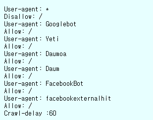
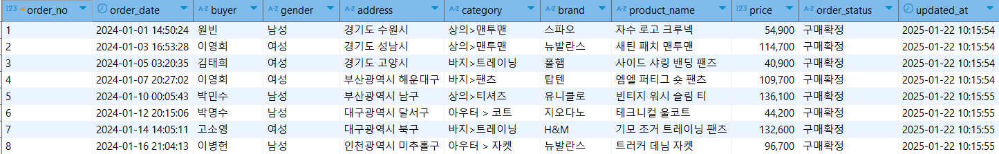

# 프로젝트 이름


## 팀원 소개


|||||
|:-:|:-:|:-:|:-:|
|김리영 (Kim Ri-yeong)<br/>[@riyeong0916](https://github.com/riyeong0916)|Ryan Na<br/>[@CooolRyan](https://github.com/CooolRyan)|Park ji hye<br/>[@parkjhhh](https://github.com/parkjhhh)|[@HyeJinSeok](https://github.com/HyeJinSeok)|

<br>

## 프로젝트 소개


실제 ElasticSearch가 활용되는 분야를 고민하던 중  △로그 수집과 분석 △추천 알고리즘을 떠올릴 수 있었다. <br>
그 중 고객 데이터를 활용해 **상품 구매 내역을 분석 및 검색하여 더 나은 추천 알고리즘을 구현**하는 방안을 모색했다. <br>
<br>
나아가, 분석 결과를 보다 직관적으로 이해하고 활용하기 위해 Kibana를 사용하여 **데이터를 시각화**했으며 <br>
 고객 구매 패턴과 추천 알고리즘 성능을 한눈에 파악할 수 있도록 대시보드를 구성했다.

<br>




온라인 커머스 플랫폼인 **'무신사'** 에서는 크롤링을 일부 허용해주는 것을 robots.txt를 통해 확인할 수 있었다. <br>
상품 데이터를 직접 크롤링하는 데 많은 시간이 소요되는 관계로, [해시스크래퍼](https://www.hashscraper.com/)의 무료 크롤링 기능을 활용했다. <br>
또한 테이블 스키마를 구성하기 위해 [Amazon Seller - Order Status Prediction](https://www.kaggle.com/datasets/pranalibose/amazon-seller-order-status-prediction) 데이터셋을 참고했다. <br>

<br>

<details>
  <summary>해시스크래퍼로 크롤링한 무신사 상품 테이블</summary>
  <br>
  <table>
    <thead>
      <tr style="background-color: #f2f2f2;">
        <th>카테고리</th>
        <th>정렬기준</th>
        <th>상품명</th>
        <th>브랜드</th>
        <th>품번</th>
        <th>판매가</th>
      </tr>
    </thead>
    <tbody>
      <tr>
        <td>아우터 > 후드 집업(인터크루)</td>
        <td>무신사 추천순</td>
        <td>[23FW] 우먼스 융기모 세미크롭 후드집업 비바마젠타 ITX4DH54AVM</td>
        <td>인터크루</td>
        <td>5007029826</td>
        <td>69,900</td>
      </tr>
      <tr>
        <td>아우터 > 후드 집업(아임낫어휴먼비잉)</td>
        <td>무신사 추천순</td>
        <td>Basic Logo Zip-up Hoodie - ROYAL BLUE</td>
        <td>아임낫어휴먼비잉</td>
        <td>hbre206</td>
        <td>69,000</td>
      </tr>
    </tbody>
  </table>
</details>
<details>
  <summary>Amazon Seller 테이블</summary>
  <br>
  <table>
    <thead>
      <tr style="background-color: #f2f2f2; color: #333;">
        <th>Order No</th>
        <th>Order Date</th>
        <th>Buyer</th>
        <th>Ship City</th>
        <th>Ship State</th>
        <th>SKU</th>
        <th>Description</th>
        <th>Quantity</th>
        <th>Item Total</th>
        <th>Shipping Fee</th>
        <th>COD</th>
        <th>Order Status</th>
      </tr>
    </thead>
    <tbody>
      <tr>
        <td>405-9763961-5211537</td>
        <td>Sun, 18 Jul, 2021, 10:38 pm IST</td>
        <td>Mr.</td>
        <td>CHANDIGARH</td>
        <td>CHANDIGARH</td>
        <td>2X-3C0F-KNJE</td>
        <td>100% Leather Elephant Shaped Piggy Coin Bank | Block Printed West Bengal Handicrafts (Shantiniketan Art) | Money Bank for Kids | Children's Gift Ideas</td>
        <td>1</td>
        <td>₹449.00</td>
        <td></td>
        <td></td>
        <td>Delivered to buyer</td>
      </tr>
      <tr>
        <td>404-3964908-7850720</td>
        <td>Tue, 19 Oct, 2021, 6:05 pm IST</td>
        <td>Minam</td>
        <td>PASIGHAT</td>
        <td>ARUNACHAL PRADESH</td>
        <td>DN-0WDX-VYOT</td>
        <td>Women's Set of 5 Multicolor Pure Leather Single Lipstick Cases with Mirror, Handy and Compact Handcrafted Shantiniketan Block Printed Jewelry Boxes</td>
        <td>1</td>
        <td>₹449.00</td>
        <td>₹60.18</td>
        <td></td>
        <td>Delivered to buyer</td>
      </tr>
    </tbody>
  </table>
</details>
<br>


위와 같은 테이블 스키마를 프로젝트 목적에 맞게 **전처리**하고, ChatGPT를 활용해 주문자 정보 **더미 데이터**를 만드는 과정을 진행했다.

```
#고객 주문을 관리하는 테이블 customerorder 정의

create table customerorder(
	order_no int primary key,
	order_date datetime,
	buyer varchar(10),
	gender ENUM('남성', '여성'),
	address varchar(50),
	category varchar(50),
	brand varchar(30),
	product_name varchar(100),
	price bigint,
	order_status ENUM('구매확정', '환불', '교환', '배송준비중'),
	updated_at TIMESTAMP default CURRENT_TIMESTAMP
);
```
<br>

< customerorder 테이블 예시 >



<br>

---

<br>

### 1. 데이터 파이프라인 구축 
MySQL 데이터베이스에서 데이터를 추출하여 Logstash를 통해 Elasticsearch로 전송하는 데이터 파이프라인을 구축하는 방법을 실습함
<br>


### 2. 데이터 처리

DB의 테이블 데이터를 수집, 변환, 필터링하고 Elasticsearch에 적합하게 저장함
<br>


### 3. Elasticsearch 활용

Elasticsearch를 활용해 빠른 검색과 분석을 수행하며, 특히 Kibana를 이용한 데이터 시각화로 분석 효율성을 극대화함.
<br>


<br>

<br>

## JDBC를 통한 Logstash와 Elastic Search 연동


```
input {
  jdbc {
    jdbc_driver_library => "D:/woorifisa/05.ELK/logstash-7.11.1-windows-x86_64/logstash-7.11.1/logstash-core/lib/jars/mysql-connector-j-9.1.0.jar"
    jdbc_driver_class => "com.mysql.cj.jdbc.Driver"
    jdbc_connection_string => "jdbc:mysql://localhost:8888/musinsa?useSSL=false&characterEncoding=utf8&serverTimezone=Asia/Seoul"
    jdbc_user => "user01"
    jdbc_password => "user01"
    statement => "SELECT * FROM `customerorder` WHERE updated_at > :sql_last_value"
    schedule => "*/5 * * * * *"  # 5초마다 실행
  }
}
```


##  데이터 필터링 


```
filter {
  # category 필드를 > 기호로 분리
  mutate {
    split => { "category" => ">" }
  }
  # 상의 카테고리와 하의 카테고리로 매핑
  mutate {
    add_field => {
      "top_category" => "%{[category][0]}"
      "sub_category" => "%{[category][1]}"
    }
  }
  # address 필드를 띄어쓰기로 분리
  mutate {
    split => { "address" => " " }
  }
  # city와 state를 분리하는 Ruby 스크립트
  ruby {
    code => '
      if event.get("address")
        parts = event.get("address")
        if parts.length >= 2
          event.set("city", parts[0])
          event.set("state", parts[1])
        end
      end
    '
  }
}
```
<br><br><br><br>


데이터 가공을 위해 먼저 카테고리 필터링과 주문자 주소 정보 필터링을 진행했다.


```
filter{
  # order_date 필드를 날짜(date)와 시간(time)으로 분리
  ruby {
    code => '
      if event.get("order_date")
        order_date = event.get("order_date").to_s
        if order_date.include?("T")
          date_time = order_date.split("T")
          if date_time.length == 2
            event.set("date", date_time[0])  # 날짜 부분
            event.set("time", date_time[1].gsub("Z", ""))  # 시간 부분 (Z 제거)
          else
            event.tag("_order_date_split_failed")
          end
        else
          event.tag("_order_date_format_invalid")
        end
      else
        event.tag("_order_date_missing")
      end
    '
  }
}
```


## Kibana를 통한 시각화


## 무신사 검색 정렬 알고리즘 톺아보기


### 스코어링 전략


무신사에서 "후드"를 검색하게 되면 후드 집업이 아닌 후드티 상품이 상위 데이터로 검색되는 화면을 볼 수 있다.


이에 반해 "후드 집업"을 검색하게 되면 결과 화면에는 후드티가 아닌 후드 집업 상품이 상위 데이터로 나타난다.<br>
그러나 "후드 집업" 혹은 "후드"를 검색하면 무조건 해당 제품만 검색되는 것은 아니다.<br>


해당 결과 화면에서는 후드 집업을 검색한 결과 중 상위 데이터의 일부는 후드 집업과 관련이 없는 상품이 존재하는 것을 볼 수 있다.


또한 후드를 검색했을 때 모자가 달린 패딩과 같은 관련성이 적은 아우터가 검색 결과에 포함된 것을 볼 수 있다.<br>
이는 검색 엔진에서 단순히 키워드를 통한 결과를 반환하는 것이 아님을 알 수 있다.
무엇이 이런 검색 결과를 나타내도록 하는 것일까 궁금증이 생기게 되었고 무신사의 검색 엔진의 방식이 궁금해졌다.


결과 화면에 단순히 키워드에 대한 score 전략으로는 충분한 데이터 필터링이 되지 않기 때문에 카테고리의 가중치가 더 클 것이라 생각했다.


후드라는 키워드를 검색하게 되면 후드 집업이라는 단순히 후드라는 상품명을 가진 제품이 더 상위에 포진해야 된다.<br>
그러나 쿼리를 통한 검색 결과를 보게 되면 후드라는 단어만 상품명에 포함한 제품과 후드 집업이라는 단어를 상품명에 포함한 제품의 score가 동일한 것을 볼 수 있다.<br>
이는 BM25 알고리즘에서 하나의 document 내의 단어 개수 중 검색 키워드 출현 개수 비율을 반영하고 있으며 두 개의 데이터 모두 3개의 단어와 하나의 "후드" 단어를 포함하고 있기 때문이라 예상해볼 수 있었다.<br>


### Nori를 사용한 Analyze


## 트러블 슈팅


### Timezone 세팅 문제


기본적으로 Logstash는 UTC 시간대를 표준으로 사용하고 있으며 이로 인해 데이터 삽입 과정에서 KST로 설정된 시간과 9시간 차이나는 값으로 삽입이 이루어짐.


### DB connection 문제


원격 데이터베이스에 접근하지 못하는 문제가 발생했다.


```
set global max_connect_errors = 10000;
set global max_connections=300;
```
