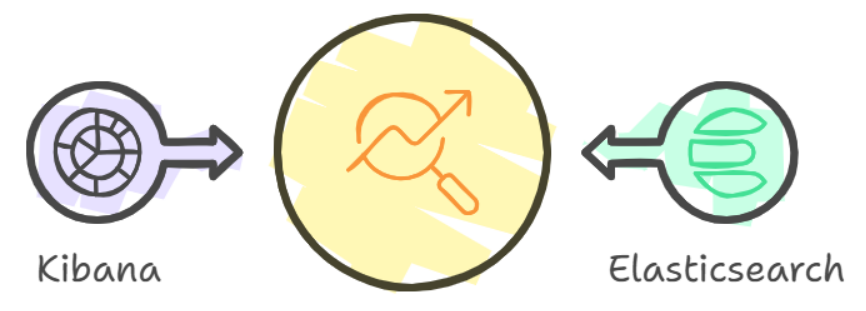

## 팀원 소개


|||||
|:-:|:-:|:-:|:-:|
|김리영 (Kim Ri-yeong)<br/>[@riyeong0916](https://github.com/riyeong0916)|Ryan Na<br/>[@CooolRyan](https://github.com/CooolRyan)|Park ji hye<br/>[@parkjhhh](https://github.com/parkjhhh)|[@HyeJinSeok](https://github.com/HyeJinSeok)|

<br>

## 프로젝트 소개


실제 ElasticSearch가 활용되는 분야를 고민하던 중  △로그 수집과 분석 △추천 알고리즘을 떠올릴 수 있었다. <br>
그 중 고객 데이터를 활용해 **상품 구매 내역을 분석 및 검색하여 더 나은 추천 알고리즘을 구현**하는 방안을 모색했다. <br>
<br>
나아가, 분석 결과를 보다 직관적으로 이해하고 활용하기 위해 Kibana를 사용하여 **데이터를 시각화**했으며 <br>
 고객 구매 패턴과 추천 알고리즘 성능을 한눈에 파악할 수 있도록 대시보드를 구성했다.

<br>


온라인 커머스 플랫폼인 **'무신사'** 에서는 크롤링을 일부 허용해주는 것을 robots.txt를 통해 확인할 수 있었다. <br>
상품 데이터를 직접 크롤링하는 데 많은 시간이 소요되는 관계로, [해시스크래퍼](https://www.hashscraper.com/)의 무료 크롤링 기능을 활용했다. <br>
또한 테이블 스키마를 구성하기 위해 [Amazon Seller - Order Status Prediction](https://www.kaggle.com/datasets/pranalibose/amazon-seller-order-status-prediction) 데이터셋을 참고했다. <br>

<br>

<details>
  <summary>해시스크래퍼로 크롤링한 무신사 상품 테이블</summary>
  <br>
  <table>
    <thead>
      <tr style="background-color: #f2f2f2;">
        <th>카테고리</th>
        <th>정렬기준</th>
        <th>상품명</th>
        <th>브랜드</th>
        <th>품번</th>
        <th>판매가</th>
      </tr>
    </thead>
    <tbody>
      <tr>
        <td>아우터 > 후드 집업(인터크루)</td>
        <td>무신사 추천순</td>
        <td>[23FW] 우먼스 융기모 세미크롭 후드집업 비바마젠타 ITX4DH54AVM</td>
        <td>인터크루</td>
        <td>5007029826</td>
        <td>69,900</td>
      </tr>
      <tr>
        <td>아우터 > 후드 집업(아임낫어휴먼비잉)</td>
        <td>무신사 추천순</td>
        <td>Basic Logo Zip-up Hoodie - ROYAL BLUE</td>
        <td>아임낫어휴먼비잉</td>
        <td>hbre206</td>
        <td>69,000</td>
      </tr>
    </tbody>
  </table>
</details>
<details>
  <summary>Amazon Seller 테이블</summary>
  <br>
  <table>
    <thead>
      <tr style="background-color: #f2f2f2; color: #333;">
        <th>Order No</th>
        <th>Order Date</th>
        <th>Buyer</th>
        <th>Ship City</th>
        <th>Ship State</th>
        <th>SKU</th>
        <th>Description</th>
        <th>Quantity</th>
        <th>Item Total</th>
        <th>Shipping Fee</th>
        <th>COD</th>
        <th>Order Status</th>
      </tr>
    </thead>
    <tbody>
      <tr>
        <td>405-9763961-5211537</td>
        <td>Sun, 18 Jul, 2021, 10:38 pm IST</td>
        <td>Mr.</td>
        <td>CHANDIGARH</td>
        <td>CHANDIGARH</td>
        <td>2X-3C0F-KNJE</td>
        <td>100% Leather Elephant Shaped Piggy Coin Bank | Block Printed West Bengal Handicrafts (Shantiniketan Art) | Money Bank for Kids | Children's Gift Ideas</td>
        <td>1</td>
        <td>₹449.00</td>
        <td></td>
        <td></td>
        <td>Delivered to buyer</td>
      </tr>
      <tr>
        <td>404-3964908-7850720</td>
        <td>Tue, 19 Oct, 2021, 6:05 pm IST</td>
        <td>Minam</td>
        <td>PASIGHAT</td>
        <td>ARUNACHAL PRADESH</td>
        <td>DN-0WDX-VYOT</td>
        <td>Women's Set of 5 Multicolor Pure Leather Single Lipstick Cases with Mirror, Handy and Compact Handcrafted Shantiniketan Block Printed Jewelry Boxes</td>
        <td>1</td>
        <td>₹449.00</td>
        <td>₹60.18</td>
        <td></td>
        <td>Delivered to buyer</td>
      </tr>
    </tbody>
  </table>
</details>
<br>


위와 같은 테이블 스키마를 프로젝트 목적에 맞게 **전처리**하고, ChatGPT를 활용해 주문자 정보 **더미 데이터**를 만드는 과정을 진행했다.

```
#고객 주문을 관리하는 테이블 customerorder 정의

create table customerorder(
	order_no int primary key,
	order_date datetime,
	buyer varchar(10),
	gender ENUM('남성', '여성'),
	address varchar(50),
	category varchar(50),
	brand varchar(30),
	product_name varchar(100),
	price bigint,
	order_status ENUM('구매확정', '환불', '교환', '배송준비중'),
	updated_at TIMESTAMP default CURRENT_TIMESTAMP
);
```
<br>

< customerorder 테이블 예시 >


<br>

---

<br>

### 1. 데이터 파이프라인 구축 
MySQL 데이터베이스에서 데이터를 추출하여 Logstash를 통해 Elasticsearch로 전송하는 데이터 파이프라인을 구축하는 방법을 실습함
<br>


### 2. 데이터 처리

DB의 테이블 데이터를 수집, 변환, 필터링하고 Elasticsearch에 적합하게 저장함
<br>


### 3. Elasticsearch 활용

Elasticsearch를 활용해 빠른 검색과 분석을 수행하며, 특히 Kibana를 이용한 데이터 시각화로 분석 효율성을 극대화함.
<br>



<br>

<br>

## JDBC를 통한 Logstash와 Elastic Search 연동


```
input {
  jdbc {
    jdbc_driver_library => "D:/woorifisa/05.ELK/logstash-7.11.1-windows-x86_64/logstash-7.11.1/logstash-core/lib/jars/mysql-connector-j-9.1.0.jar"
    jdbc_driver_class => "com.mysql.cj.jdbc.Driver"
    jdbc_connection_string => "jdbc:mysql://localhost:8888/musinsa?useSSL=false&characterEncoding=utf8&serverTimezone=Asia/Seoul"
    jdbc_user => "user01"
    jdbc_password => "user01"
    statement => "SELECT * FROM `customerorder` WHERE updated_at > :sql_last_value"
    schedule => "*/5 * * * * *"  # 5초마다 실행
  }
}
```


##  데이터 필터링 


```
filter {
  # category 필드를 > 기호로 분리
  mutate {
    split => { "category" => ">" }
  }
  # 상의 카테고리와 하의 카테고리로 매핑
  mutate {
    add_field => {
      "top_category" => "%{[category][0]}"
      "sub_category" => "%{[category][1]}"
    }
  }
  # address 필드를 띄어쓰기로 분리
  mutate {
    split => { "address" => " " }
  }
  # city와 state를 분리하는 Ruby 스크립트
  ruby {
    code => '
      if event.get("address")
        parts = event.get("address")
        if parts.length >= 2
          event.set("city", parts[0])
          event.set("state", parts[1])
        end
      end
    '
  }
}
```
<br><br><br><br>


데이터 가공을 위해 먼저 카테고리 필터링과 주문자 주소 정보 필터링을 진행했다.


```
filter{
  # order_date 필드를 날짜(date)와 시간(time)으로 분리
  ruby {
    code => '
      if event.get("order_date")
        order_date = event.get("order_date").to_s
        if order_date.include?("T")
          date_time = order_date.split("T")
          if date_time.length == 2
            event.set("date", date_time[0])  # 날짜 부분
            event.set("time", date_time[1].gsub("Z", ""))  # 시간 부분 (Z 제거)
          else
            event.tag("_order_date_split_failed")
          end
        else
          event.tag("_order_date_format_invalid")
        end
      else
        event.tag("_order_date_missing")
      end
    '
  }
}
```


## Kibana를 통한 시각화
- 상품 구매 내역 데이터를 기반으로 **△일별 주문 건수 및 매출 △2025년 주문 현황 △2025년 일일 매출 △우수회원 △브랜드별 성별 인기도** 를 시각화하여 모니터링 대시보드 구축
<p align="center">
    
</p>

1. 일별 주문 건수 및 매출
<p align="center">
    
</p>

2. 2025년 주문 현황 
<p align="center">
    
</p>

3. 2025년 일일 매출
<p align="center">
    
</p>

4. 우수회원
<p align="center">
    
</p>

5. 브랜드별 성별 인기도
<p align="center">
    
</p>


## 무신사 검색 정렬 알고리즘 톺아보기


- 무신사의 검색 알고리즘의 문제점 <br>


<br>


- 적합도 반영 전략


### 스코어링 전략


<br>

무신사에서 "후드"를 검색하게 되면 후드 집업이 아닌 후드티 상품이 상위 데이터로 검색되는 화면을 볼 수 있다.


이에 반해 "후드 집업"을 검색하게 되면 결과 화면에는 후드티가 아닌 후드 집업 상품이 상위 데이터로 나타난다.<br>
그러나 "후드 집업" 혹은 "후드"를 검색하면 무조건 해당 제품만 검색되는 것은 아니다.<br>


해당 결과 화면에서는 후드 집업을 검색한 결과 중 상위 데이터의 일부는 후드 집업과 관련이 없는 상품이 존재하는 것을 볼 수 있다.


또한 후드를 검색했을 때 모자가 달린 패딩과 같은 관련성이 적은 아우터가 검색 결과에 포함된 것을 볼 수 있다.<br>
이는 검색 엔진에서 단순히 키워드를 통한 결과를 반환하는 것이 아님을 알 수 있다.


스코어링 수식에서 카테고리와 브랜드의 가중치 또한 포함되는 것을 알 수 있었고 지퍼가 없는 "후드"를 원하는 사용자가 후드라는 단어를 검색하면 "후드 티셔츠" 카테고리의 상품이 상위에 나오게 된다.


이에 반해 "후드 집업"을 검색하게 되면 후드 집업 카테고리에 속한 제품들이 나오게 된다.


이를 통해 결과 화면에 단순히 키워드에 대한 score 전략으로는 충분한 데이터 필터링이 되지 않기 때문에 카테고리의 가중치가 더 클 것이라 추론했다.


현재 사용 중인 Elastic Search에서 브랜드 관련 Field를 보유하고 있지만 이에 대한 가중치 기준을 세우는데 어려움이 존재한다.


이로 인해 좀 더 확실한 기준을 세울 수 있는 카테고리를 상품과 함께 연동되어 가중치 계산이 되도록 진행했다.<br><br>


"후드"라는 키워드를 검색하게 되면 후드 집업이라는 단순히 후드라는 상품명을 가진 제품이 더 상위에 포진해야 된다.


그러나 현재 쿼리를 통한 검색 결과를 보게 되면 후드라는 단어만 상품명에 포함한 제품과 후드 집업이라는 단어를 상품명에 포함한 제품의 score가 동일한 것을 볼 수 있다.


이는 BM25 알고리즘에서 하나의 document 내의 단어 개수 중 검색 키워드 출현 개수 비율을 반영하고 있으며 두 개의 데이터 모두 3개의 단어와 하나의 "후드" 단어를 포함하고 있기 때문이라 예상해볼 수 있었다.


```
POST /musinsa/_search
{
  "query": {
    "function_score": {
      "query": {
        "match": {
          "product_name": "후드"
        }
      },
      "functions": [
        {
          "filter": {
            "term": {
              "sub_category.keyword": "후드 티셔츠"
            }
          },
          "weight": 3.0  // 카테고리: 상의 > 후드 티셔츠
        },
        {
          "filter": {
            "term": {
              "sub_category.keyword": "후드 집업"
            }
          },
          "weight": 0.5  // 카테고리: 아우터 > 후드 집업
        },
        {
          "filter": {
            "match_phrase": {
              "product_name": "후드"
            }
          },
          "weight": 2.0  // 상품명: "후드"
        }
      ],
      "score_mode": "sum",  // 가중치를 단순 합산
      "boost_mode": "sum"  // 기본 BM25 스코어와 가중치를 합산
    }
  }
}
```


1차적으로 진행한 가중치 개선에서 "후드"라는 단어와 함께 하위 카테고리의 가중치를 조정했고 후드티의 score가 대체적으로 후드 집업 상품에 비해 높아진 것을 확인할 수 있었다.


```
        "_index" : "musinsa",
        "_type" : "_doc",
        "_id" : "111",
        "_score" : 3.4028943,
        "_source" : {
          "category" : [
            "아우터 ",
            " 후드 집업"
          ],
          "top_category" : "아우터 ",
          "@timestamp" : "2025-01-21T16:56:20.123Z",
          "product_name" : "투웨이 후드 집업",
          "sub_category" : " 후드 집업",
        }
      },
      {
        "_index" : "musinsa",
        "_type" : "_doc",
        "_id" : "2",
        "_score" : 3.4028943,
        "_source" : {
          "category" : [
            "상의 ",
            " 후드 티셔츠"
          ],
          "top_category" : "상의 ",
          "@timestamp" : "2025-01-21T16:56:20.122Z",
          "product_name" : "미니멀 오버핏 후드",
          "sub_category" : " 후드 티셔츠",
        }
      },
```


그러나 문장에 존재하는 단어의 개수가 같은 경우에 후드 집업과 후드티의 score가 동일한 결과를 일부 확인할 수 있었다.


이를 좀 더 개선하기 위해 상위 카테고리와 하위 카테고리 모두 가중치를 조정했다. 무신사의 카테고리 분류에서는 후드 집업은 아우터로, 후드 티셔츠는 상의로 분류하고 있는 점을 고려해 조정했다.


```
POST /musinsa/_search
{
  "query": {
    "function_score": {
      "query": {
        "match": {
          "product_name": "후드"
        }
      },
      "functions": [
        {
          "filter": {
            "term": {
              "top_category": "상의"
            }
          },
          "weight": 3.0  // "상의" 카테고리 가중치
        },
        {
          "filter": {
            "term": {
              "top_category": "아우터"
            }
          },
          "weight": 0.5  // "아우터" 카테고리 가중치
        },
        {
          "filter": {
            "term": {
              "sub_category": "후드 티셔츠"
            }
          },
          "weight": 2.0  // "후드 티셔츠" 하위 카테고리 가중치
        },
        {
          "filter": {
            "term": {
              "sub_category": "후드 집업"
            }
          },
          "weight": 0.5  // "후드 집업" 하위 카테고리 가중치
        },
        {
          "filter": {
            "match_phrase": {
              "product_name": "후드"
            }
          },
          "weight": 1.5  // "후드" 포함 가중치
        },
        {
          "filter": {
            "match_phrase": {
              "product_name": "후드 집업"
            }
          },
          "weight": 0.5  // "후드 집업" 포함 가중치 감소
        }
      ],
      "score_mode": "sum",  // 점수 합산
      "boost_mode": "sum"  // 기본 BM25와 합산
    }
  }
}
```


이를 통해 확실한 score 차이를 확인할 수 있었다.


```
        "_index" : "musinsa",
        "_type" : "_doc",
        "_id" : "3",
        "_score" : 5.902894,
        "_source" : {
          "category" : [
            "상의 ",
            " 후드 티셔츠"
          ],
          "top_category" : "상의 ",
          "product_name" : "그래픽 베이직 후드",
          "sub_category" : " 후드 티셔츠",
        }
      },
      {
        "_index" : "musinsa",
        "_type" : "_doc",
        "_id" : "111",
        "_score" : 3.9028943,
        "_source" : {
          "category" : [
            "아우터 ",
            " 후드 집업"
          ],
          "top_category" : "아우터 ",
          "product_name" : "투웨이 후드 집업",
          "sub_category" : " 후드 집업"
        }
```
<br>

- script_score를 통한 score 차이 개선


위에서 사용한 예시는 function_score 조정을 통한 결과를 확인한 것이다.


script_score 조정을 진행하게 되면 BM25 결과 값을 직접 조정할 수 있다.


```
POST /musinsa/_search
{
  "query": {
    "script_score": {
      "query": {
        "match": {
          "product_name": "후드"
        }
      },
      "script": {
        "source": """
          double score = _score;

          // 상위 카테고리 가중치
          if (doc['top_category'].value == '상의') {
            score += 3.0;
          } else if (doc['top_category'].value == '아우터') {
            score += 0.5;
          }

          // 하위 카테고리 가중치
          if (doc['sub_category'].value == '후드 티셔츠') {
            score += 2.0;
          } else if (doc['sub_category'].value == '후드 집업') {
            score += 0.5;
          }

          return score;
        """
      }
    }
  }
}
```

BM25 값을 직접 조정하게 되면서 score 값 또한 더 확실한 차이를 만들어낼 수 있었다.


```
      {
        "_index" : "musinsa",
        "_type" : "_doc",
        "_id" : "3",
        "_score" : 4.402894,
        "_source" : {
          "category" : [
            "상의 ",
            " 후드 티셔츠"
          ],
          "top_category" : "상의 ",
          "product_name" : "그래픽 베이직 후드",
          "sub_category" : " 후드 티셔츠",
        }
      },
      {
        "_index" : "musinsa",
        "_type" : "_doc",
        "_id" : "111",
        "_score" : 1.9028943,
        "_source" : {
          "category" : [
            "아우터 ",
            " 후드 집업"
          ],
          "top_category" : "아우터 ",
          "product_name" : "투웨이 후드 집업",
          "sub_category" : " 후드 집업",
      },
```


#### `function_score`와 `script_score` 비교


| **특징**                  | **`function_score`**                                       | **`script_score`**                                      |
|--------------------------|---------------------------------------------------------|-------------------------------------------------------|
| **BM25 스코어 사용 여부**    | BM25 스코어를 기반으로 가중치를 조정 (BM25 스코어를 변경하지 않음).  | BM25 스코어를 포함하여 사용자 정의 점수 계산 가능 (직접 변경 가능). |
| **작동 방식**              | BM25 스코어에 가중치를 곱하거나 더해 점수를 조정.              | `_score`를 기반으로 사용자 정의 계산식을 작성하여 점수 계산.       |
| **스코어 계산 공식**        | 최종 스코어 = BM25 스코어 × 가중치                          | 최종 스코어 = 사용자 정의 계산식                              |
| **유연성**                 | 사전 정의된 함수(`weight`, `boost_mode` 등) 사용.          | 사용자 정의 스크립트를 통해 세부 계산식 작성 가능.         |
| **성능**                  | 빠름 (사전 정의된 함수만 사용).                              | 상대적으로 느림 (스크립트 실행 시 계산 오버헤드 발생).       |
| **사용 목적**              | 가중치 조정 및 필터링을 통한 점수 개선.                         | 점수 계산식이나 복잡한 조건을 유연하게 처리.                |
| **적용 가능한 함수**         | 가중치(`weight`), 필드 기반(`field_value_factor`), 필터(`filter`). | 사용자 정의 계산식 (BM25 스코어 포함).                    |
| **권장 상황**              | 단순한 가중치 조정이 필요한 경우.                              | 복잡한 조건이나 사용자 정의 계산식이 필요한 경우.            |

<br><br>


### Nori를 사용한 Analyze


<br><br>


무신사의 검색 서비스 프로토타입에서 형태소 분석을 위한 토크나이저로 Nori(Lucene의 한글 형태소 분석기)의 파이썬 버전 Pynori를 사용했다.


이를 통해 동의어 및 사용자 사전을 커스텀하게 적용할 수 있기 때문에, 기존에 무신사 검색 서비스에서 사용 중이던 사전을 그대로 적용하여 최대한 실제 서비스와 비슷한 시뮬레이션 환경을 구현해냈다.


여기서 착안해 elastice search에서 제공하는 nori를 통한 상품 데이터 분석을 진행해보고자 했다.


```
elasticsearch-plugin install analysis-nori
```


먼저 nori를 사용하기 위한 plugin 설치를 진행한다.


```
PUT /musinsa_with_nori
{
  "settings": {
    "analysis": {
      "analyzer": {
        "nori_analyzer": {
          "type": "custom",
          "tokenizer": "nori_tokenizer",
          "filter": ["lowercase", "nori_readingform", "nori_part_of_speech"]
        }
      },
      "filter": {
        "nori_part_of_speech": {
          "type": "nori_part_of_speech",
          "stoptags": ["E", "IC", "J", "MAG", "MAJ", "MM", "SP", "SSC", "SSO", "SY", "UNA", "UNKNOWN", "VA", "VCN", "VCP", "VV", "VX", "XPN", "XR", "XSA", "XSN", "XSV"]
        }
      }
    }
  },
  "mappings": {
    "properties": {
      "@timestamp": { "type": "date" },
      "product_name": {
        "type": "text",
        "analyzer": "nori_analyzer",
        "fielddata": true  // fielddata 활성화
      },
      "category": {
        "type": "text",
        "analyzer": "nori_analyzer",
        "fielddata": true
      },
      "sub_category": {
        "type": "text",
        "analyzer": "nori_analyzer",
        "fielddata": true
      },
      "top_category": {
        "type": "text",
        "analyzer": "nori_analyzer",
        "fielddata": true
      },
      "price": { "type": "long" },
      "brand": { "type": "keyword" },
      "updated_at": { "type": "date" }
    }
  }
}
```


이 후 nori를 사용하기 위한 새로운 인덱스를 생성한다. 기존에 생성된 인덱스를 수정하는 것이 불가능 하기 때문에 새로운 인덱스를 생성하고 기존 인덱스의 데이터를 이관하는 작업을 진행했다.


```
POST /_reindex
{
  "source": {
    "index": "musinsa"
  },
  "dest": {
    "index": "musinsa_with_nori"
  }
}
```


재인덱싱 과정 이후 aggregation function을 통해 search를 진행하게 되면 형태소 분석을 통한 파싱이 진행된다.


```
GET /musinsa_with_nori/_search
{
  "size": 0,
  "aggs": {
    "product_name_count": {
      "terms": {
        "field": "product_name",
        "size": 10
      }
    }
  }
}
```


- 결과 화면 비교 및 개선


기존의 aggregation function을 통한 count를 진행하게 되면 product_name의 전체 value를 기준으로 count 되는 모습을 보여주었다.


<br><br>


그러나 field에 nori 사용을 위한 analyze를 추가한 뒤 aggregation function을 사용하면 형태소 별 분리가 된 결과를 볼 수 있다.


<br><br>


이 때 "후드 집업" 이라는 단어가 "후드", "집", "업"으로 분리되는 것을 확인할 수 있다.


이는 nori analyze에서 제공하는 복합어 처리 과정에서 단어가 분리되는 것이다. 그러나 이런 형태로 데이터 분석을 진행하게 된다면 정확한 분석이 불가능할 것이라 생각했다.


```
"analysis": {
  "tokenizer": {
    "nori_tokenizer": {
      "type": "nori_tokenizer",
      "decompound_mode": "mixed"  // 복합어 및 원래 단어
    }
  }
```


이를 해결하기 위해 인덱스 생성 시 decompound_mode 설정을 mix로 설정해 복합어 분리가 되지 않은 데이터 또한 같이 확인할 수 있었다.


```
     "tokenizer": {
        "nori_tokenizer": {
          "type": "nori_tokenizer",
          "user_dictionary": "analysis/userdict_ko.txt"
        }
      }
```
사용자 정의 사전을 포함한 nori 활용을 위해서는 위의 코드와 같이 user_dictionary를 포함해서 사용할 수 있다.


## 트러블 슈팅


### Timezone 세팅 및 새로운 정보 update 문제


기본적으로 Logstash는 UTC 시간대를 표준으로 사용하고 있으며 이로 인해 데이터 삽입 과정에서 KST로 설정된 시간과 9시간 차이나는 값으로 삽입이 이루어진다.


```
SELECT * FROM `customerorder` WHERE updated_at > :sql_last_value
```


updated_at을 기준으로 새로 추가된 데이터를 ES 상에 추가하기 때문에 시간을 정상적으로 인식하지 못하게 되었다.


데이터베이스의 order_no과 document의 _id 값을 매핑이 되도록 해 덮어쓰기를 진행하는 과정을 통해 데이터가 지속적으로 쌓이지 않도록 했다.


그러나 이를 반영하지 못하는 팀원의 케이스도 발생했으며 이로 인해 5초마다 업데이트 될때마다 새로운 정보를 업데이트 하는 것이 아닌 처음부터 모든 데이터를 업데이트 하게 되어 데이터가 116,110까지 쌓이게 되고, 비효율적으로 업데이트를 하게되었다.
<br>

<p align="center">
  
</p>

<br>
order_no 칼럼을 기준으로 새로운 데이터가 업데이트 되도록 설정했다.  
또한 마지막으로 가져온 정보를 `C:\\00.dataSet\\logstash_jdbc_last_run` 경로에 저장하여 Logstash를 실행하면 이 파일을 읽고 마지막으로 실행된 `order_no`를 확인하고 새로운 데이터를 업데이트했다.

```ruby
use_column_value => true
tracking_column => "order_no"
tracking_column_type => "numeric"
last_run_metadata_path => "C:\\00.dataSet\\logstash_jdbc_last_run"
schedule => "*/5 * * * * *"  # 5초마다 실행
```

가장 마지막 order_no 내용만 업데이트 되고 있음을 확인했다.
<br>


### DB connection 문제


원격 데이터베이스에 접근하지 못하는 문제가 발생했다.


원격 서버에서 MySQL 서버로 연결한 뒤 close를 하면 MySQL은 비정상적인 접속으로 판단해 해당 IP를 블락 처리한다고 한다.

이 때 MySQL에서 이와 같은 비정상적인 접속 요청 수를 카운팅해서 global.max_connect_errors에 지정된 값을 넘기면 자동 블락 처리가 되어 생긴 이슈다.


```
set global max_connect_errors = 10000;
set global max_connections=300;
flush hosts;
```


위의 명령어를 통해 max_connect_errors 값을 증가시키고 그 동안의 접속 요청 기록을 초기화 해주는 과정을 통해 정상적으로 원격 데이터베이스에 다시 접속할 수 있었다.


### Elastic Search의 text와 keyword


- Elasticsearch 필드 타입: `keyword` vs `text`


| **특징**                | **`keyword`**                                          | **`text`**                                              |
|------------------------|-----------------------------------------------------|-------------------------------------------------------|
| **용도**               | 정렬, 집계, 필터링에 적합 (정확히 일치하는 값을 비교).       | 검색, 분석, 자연어 처리를 위해 적합.                        |
| **저장 방식**            | 전체 문자열이 인덱싱되고, 분석되지 않음.                     | 텍스트를 분석(토크나이징)하여 여러 토큰으로 저장.               |
| **토크나이저**            | 없음 (문자열 전체를 하나의 값으로 저장).                   | 텍스트를 공백, 구두점 등을 기준으로 나누어 여러 토큰으로 저장.     |
| **검색 동작**            | 정확히 일치하는 값만 검색 가능.                              | 텍스트의 부분적 일치(예: "후드" 포함) 검색 가능.               |
| **Aggregation 지원 여부** | 지원 (집계와 정렬 가능).                                    | 기본적으로 지원되지 않음 (집계를 위해선 `fielddata` 활성화 필요). |
| **데이터 크기**           | 저장 크기가 작음 (원본 값만 저장).                          | 토큰화된 데이터를 추가로 저장하므로 저장 크기가 더 큼.             |

---


### **문제**
`text` 필드를 Aggregation에 사용하려고 하면 다음과 같은 오류가 발생한다:

```json
{
  "error": {
    "type": "illegal_argument_exception",
    "reason": "Fielddata is disabled on text fields by default. Set fielddata=true on [field_name] in order to load field data by uninverting the inverted index."
  }
}
```


text 필드가 검색과 분석을 위해 설계되어 있으며, Aggregation처럼 정확한 값을 요구하는 작업을 지원하지 않기 때문이다.


또한 keyword에 analyzer를 설정할 수 없었다.


keyword 타입은 데이터를 토큰화하거나 분석하지 않는다.


반면 **analyzer**는 텍스트를 분리하고 형태소 분석을 수행하도록 설계되었다.


두 개념이 충돌하므로 keyword 타입에서 analyzer를 설정할 수 없다.


- 해결책


Aggregation에서 text 활용법


```
PUT /index_name/_mapping
{
  "properties": {
    "field_name": {
      "type": "text",
      "fielddata": true
    }
  }
}
```


field에 대한 fielddata를 true로 설정해주는 과정을 통해 text 필드를 Aggregation function에 사용할 수 있다.
